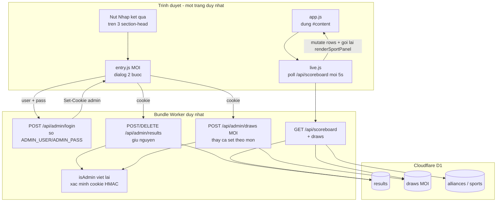

# Modal Nhập kết quả all-in-one — Hội thao BATECO 2026

## Overview

Website hội thao hiện là một Cloudflare Worker đóng gói all-in-one: `scripts/build.mjs`
nhúng toàn bộ HTML/CSS/JS trong `dist/` cùng `server/domain.mjs` vào một file
`dist/server/index.js` duy nhất, vừa phục vụ trang vừa phục vụ API.

Kế hoạch này thêm nút **Nhập kết quả** vào ba section `#bang-dau`, `#huy-chuong`,
`#ket-qua`. Nút mở một modal dùng chung gồm hai bước: đăng nhập, rồi form nhập liệu
tương ứng với đúng các cột mà section đó hiển thị. Trang quản trị riêng `/admin`
bị xóa để chỉ còn một đường vào duy nhất.

Hai thay đổi nền tảng bắt buộc phải làm kèm theo:

1. **Xác thực hiện tại đã hỏng ở local.** `isAdmin()` trong `server/worker.mjs:6`
   đọc header `oai-authenticated-user-id` do proxy OpenAI Apps hosting chèn vào.
   Header đó không tồn tại dưới `wrangler dev`, nên `POST /api/admin/results` và
   `GET /admin` đều trả 401 (đã xác nhận bằng curl trên server đang chạy). Yêu cầu
   đăng nhập `bateco`/`123` thay thế cơ chế này chứ không chồng lên nó.
2. **Bảng đấu chưa có nơi lưu trữ.** `officialCompetitionData` trong `dist/app.js:25`
   hardcode `rows:[]` cho cả 5 môn. Không có bảng, không có API. Phải thêm mới.

## Goals

| # | Goal | Priority |
|---|------|----------|
| 1 | Đăng nhập `bateco`/`123` kiểm tra ở server, cookie ký HMAC, mật khẩu không nằm trong bundle client | P1 |
| 2 | Một modal dùng chung cho cả ba section, form đổi theo section mở nó | P1 |
| 3 | Bảng đấu có nơi lưu trữ thật và nhập được từ modal | P1 |
| 4 | Gộp về một trang duy nhất, xóa `/admin` | P1 |
| 5 | Bảng tổng sắp huy chương vẫn luôn được tính ra từ kết quả, không nhập tay | P1 |

## Phases

| # | Phase | Status | Depends on |
|---|-------|--------|------------|
| 1 | [Phase 1: Nền tảng xác thực](./phase-01-auth-foundation.md) | Pending | — |
| 2 | [Phase 2: Modal và form kết quả](./phase-02-modal-ket-qua.md) | Pending | 1 |
| 3 | [Phase 3: Bảng đấu](./phase-03-bang-dau.md) | Pending | 1, 2 |
| 4 | [Phase 4: Kiểm thử và chuẩn bị deploy](./phase-04-verify-deploy.md) | Pending | 1, 2, 3 |

## Architecture

## Ba section cần nhập gì

Lấy trực tiếp từ định nghĩa bảng trong mã nguồn, không suy đoán.

| Section | Cột đang hiển thị | Nguồn dữ liệu | Việc phải làm |
|---|---|---|---|
| `#ket-qua` | Trận/Phần thi · Đội/VĐV · Kết quả · Huy chương | bảng `results`, đã có API đầy đủ | Chuyển form từ `dist/admin.js` vào modal |
| `#huy-chuong` | Liên minh · HCV · HCB · HCĐ · Xếp hạng | **tính ra** từ `standings()` | Mở đúng form kết quả, không làm editor huy chương riêng |
| `#bang-dau` | 4 cột thay đổi theo môn | **chưa có gì** | Thêm bảng `draws`, API, và form 4 cột |

Nhãn cột của Bảng đấu đổi theo môn, lấy từ `competitionViews[i].columns` có sẵn:

| Môn | Cột 1 | Cột 2 | Cột 3 | Cột 4 |
|---|---|---|---|---|
| Kéo co | Bảng / Vòng | Cặp đấu | Lượt thi đấu | Lịch thi đấu |
| Điền kinh | Nội dung | VĐV | Lượt chạy | Lịch thi đấu |
| Pickleball | Bảng / Vòng | Cặp đấu | Sân | Lịch thi đấu |
| AOE | Bảng / Vòng | Cặp đấu | Lượt thi đấu | Lịch thi đấu |
| Bóng đá Nam | Bảng / Vòng | Cặp đấu | Sân | Lịch thi đấu |

Vì môn nào cũng đúng 4 cột văn bản, một bảng `draws(sport_id, ord, c1..c4)` phục vụ
được cả 5 môn và cắm thẳng vào `renderSportPanel` mà không phải sửa renderer.

## Quyết định thiết kế đã chốt

**Xác thực đặt ở server, không đặt ở client.** Nếu kiểm tra trong JS thì `123` nằm
thẳng trong `app.js` và `/api/admin/results` phải mở hoàn toàn, nghĩa là bất kỳ ai
biết URL đều xóa sạch được bảng huy chương giữa ngày hội thao. Đặt ở server tốn
khoảng 40 dòng và loại bỏ hẳn rủi ro đó.

**Cookie ký HMAC, không lưu session ở D1.** Worker không có bộ nhớ giữa các request.
Cookie tự chứng thực bằng chữ ký nên không cần bảng session, không cần dọn rác.

**Bảng đấu lưu theo kiểu thay cả set.** Chỉ có một người nhập nên không cần
`revision` như bảng `results`. Một `env.DB.batch()` xóa hết rồi chèn lại toàn bộ
dòng của môn đó, chạy trong một transaction.

**Huy chương không nhập tay.** `standings()` tính HCV/HCB/HCĐ từ trường
`gold`/`silver`/`bronze` của từng kết quả. Cho nhập số huy chương trực tiếp sẽ tạo
ra hai nguồn sự thật lệch nhau.

## Rủi ro và cách xử lý

| Rủi ro | Ảnh hưởng | Cách xử lý |
|---|---|---|
| `build.mjs` thay chuỗi import bằng so khớp chính xác; thêm export mới vào `domain.mjs` sẽ làm hỏng việc nhúng mà không báo lỗi | Cao | Phase 1 đổi sang thay bằng regex một lần cho xong |
| `pnpm test` không build trước, dễ test nhầm bundle cũ | Cao | Phase 1 sửa script `test` để build trước |
| Cookie `Secure` không gửi qua HTTP khi mở từ máy khác trong LAN | Trung bình | Chỉ đặt `Secure` khi `url.protocol === 'https:'` |
| Mật khẩu `123` đoán ra trong vài giây nếu có người cố tình thử | Trung bình | Delay 500ms mỗi lần sai; production đặt secret mạnh hơn bằng `wrangler secret put`, không phải sửa code |
| Xóa `/admin` làm mất đường vào dự phòng khi modal lỗi | Thấp | Phase 4 kiểm thử tay đủ ba section trước khi coi là xong |

## Success Criteria

- [ ] `pnpm test` xanh, có test mới cho đăng nhập (đúng, sai, cookie hết hạn, chữ ký sai) và cho `draws` (thay set, validate, bắt buộc đăng nhập)
- [ ] Trên `wrangler dev` cổng 8787: cả ba nút mở được modal; sai mật khẩu bị từ chối; đúng mật khẩu vào được form
- [ ] Lưu một kết quả từ `#ket-qua` thì kết quả hiện trong bảng và bảng tổng sắp huy chương đổi theo
- [ ] Lưu dòng bảng đấu từ `#bang-dau` thì hiện đúng tab môn đó và còn nguyên sau khi tải lại trang
- [ ] `POST /api/admin/results` khi chưa đăng nhập vẫn trả 401
- [ ] `node scripts/build.mjs` chạy được và không còn tham chiếu tới `admin.html` / `admin.js`

## Câu hỏi mở

- Mật khẩu production giữ `123` hay đặt giá trị mạnh hơn? Đây là secret nên đổi được
  bằng `wrangler secret put ADMIN_PASS` mà không cần sửa code hay đổi kế hoạch. Local
  vẫn dùng `bateco`/`123` đúng như yêu cầu. Quyết định ở Phase 4, không chặn Phase 1-3.

<!-- slug: nhap-ket-qua-modal -->
